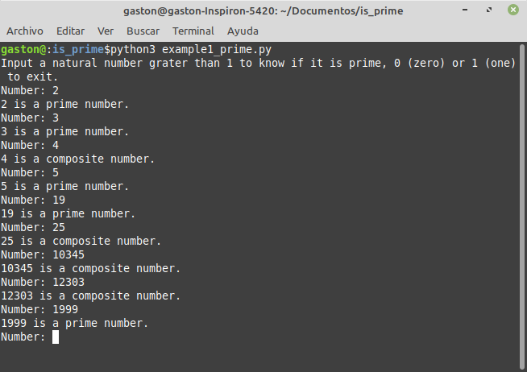

## Simple function to know if a given natural number is prime or not

### Prime number definition
```
A prime number (or a prime) is a natural number greater than 1 that is not a product of two smaller natural numbers. A natural number greater than 1 that is not prime is called a composite number.
*From Wikipedia, the free encyclopedia*
```

### isPrime() function
Return True if a given natural number is prime and False if it is not
```python
def isPrime(num):
    if num < 2:
        return None
    if num == 2:
        return True
    if num%2==0:
        return False
    for n in range(2,num):
        if num%n == 0:
            return False
        if num%n > 1:
            return True
    return True
```

### Explanation
The number 2 is prime.
All even natural numbers greater than 2 are not prime.
Being num an odd natural number greater than 2:
    If the modulus of the division of num by another number n (where 2 <= n < num) converges to 0 (zero), then num is not prime.
    If not, num is prime.

Number: 3
- 3%2 = 1
3 is prime.

Number: 5
- 5%2 = 1
- 5%3 = 2
5 is prime.

Number: 7
- 7%2 = 1
- 7%3 = 1
- 7%4 = 3
7 is prime.

Number: 9
- 9%2 = 1
- 9%3 = 0
9 is not prime.

Number: 11
- 11%2 = 1
- 11%3 = 2
11 is not prime.

Number: 19
- 19%2 = 1
- 19%3 = 1
- 19%4 = 3
19 is prime.

Number: 25
- 25%2 = 1
- 25%3 = 1
- 25%4 = 1
- 25%5 = 0
25 is not prime.

### Examples


